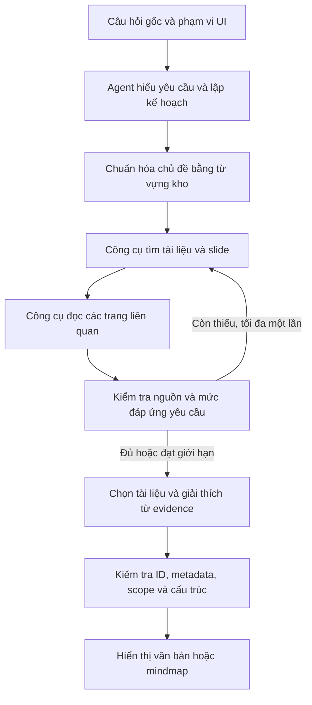

# Đề xuất agent cho chatbot RAG và mindmap tài liệu học tập

Ngày phân tích: 2026-09-19. Trạng thái: đã triển khai MVP một bộ điều phối có giới hạn; các phần multiagent/index cấp tài liệu là lộ trình tiếp theo.

MVP nằm trong `app/agent/`, tích hợp `/api/chat` và giao diện. Dùng kế hoạch/thẩm định JSON có schema, các công cụ do ứng dụng thực thi và một vòng tìm lại khi model xác định còn thiếu nguồn. Chưa dùng vòng function calling tự do hoặc thêm Agents SDK. Nguồn và vị trí được kiểm tra bằng mã; độ liên quan cần đánh giá trên tập chuẩn. Chi tiết vận hành và kiểm thử xem README.

## 1. Kết luận

Triển khai một agent điều phối có công cụ trên nền RAG hiện có trước. Agent phân tích yêu cầu thành tác vụ, định dạng và phạm vi; truy xuất, kiểm tra tài liệu; sau đó tạo câu trả lời hoặc mindmap. Chỉ thêm agent chuyên môn khi đánh giá cho thấy cần tìm hiểu nhiều phần độc lập.

Không cần thay model đã cấu hình, chuyển cơ sở dữ liệu, xây GraphRAG hay thêm API key để thực hiện thiết kế này bằng các dịch vụ hiện có. Chi phí tăng chủ yếu từ số lượt gọi LLM và rerank. Giữ các endpoint hiện tại trong quá trình bổ sung orchestration.

## 2. Nguyên nhân thất bại hiện tại

Câu hỏi: “tạo mindmap các file tài liệu tôi cần học tên gì nằm ở day nào để tôi hiểu về tranformers”. Đây là tác vụ **tìm tài liệu học về một chủ đề**, với **định dạng mindmap** và các trường bắt buộc **tên file, ngày học**.

Các điểm đã kiểm tra trong mã:

- `app/viewer/static/app.js`: `resolveMindmapIntent()` chỉ giữ day/scope/topic; `handleMindmapChat()` gửi topic sang `/api/mindmap/generate`, không gửi câu hỏi gốc. Yêu cầu tìm tài liệu/ngày bị mất.
- `app/api/main.py`: `generate_mindmap()` truy xuất trực tiếp topic rồi gọi `qa.mindmap()`. Không có bước tìm và tổng hợp theo tài liệu.
- `app/retrieval/query.py`: sửa chính tả và mở rộng transformer/transformers chỉ chạy khi phát hiện truy vấn tìm tài liệu và khớp một số mẫu câu. Topic đơn lẻ `tranformers` không đi qua bước này. Cụm “để tôi hiểu về” cũng chưa thuộc mẫu tách topic hiện tại.
- `app/qa/prompts.py`: mindmap prompt tạo nhánh khái niệm từ evidence; không phân biệt mindmap kiến thức với mindmap danh sách tài liệu. `build_mindmap_prompt()` không gửi day metadata cho model dù evidence có thông tin này.
- `app/qa/service.py`: kiểm tra evidence ID giúp giữ nguồn thật, nhưng không chứng minh mọi nhãn hoặc đề xuất học có ý nghĩa đúng với nguồn.

Kiểm tra đọc chỉ mục: 2.604 slide; 10 PDF có ít nhất một trang nhắc `transformer` hoặc `transformers`. Ví dụ `Day01/day01-llm-foundation-1.pdf` có 9 trang khớp. Đây là tín hiệu có ứng viên để tìm kiếm, **không phải danh sách tài liệu nên học đã được thẩm định**. Chưa chạy lại câu hỏi này qua provider trong lần phân tích này; không thể khẳng định lỗi chính tả là nguyên nhân duy nhất khiến model trả nhánh rỗng.

## 3. Kiến trúc đề xuất



Vòng tìm kiếm phải có giới hạn. Agent được chọn truy vấn và tài liệu cần đọc; backend giữ quyền thực thi, kiểm tra phạm vi và xác nhận nguồn. Chuẩn hóa, nối metadata, kiểm tra nguồn và dựng cây không cần mỗi bước một agent LLM.

OpenAI function calling cho phép model yêu cầu gọi hàm ứng dụng với đối số theo schema; ứng dụng thực thi và trả kết quả cho model. Dùng schema strict cho đối số nếu provider hỗ trợ; vẫn kiểm tra dữ liệu trong backend vì đúng schema không bảo đảm đúng ý nghĩa. [Tài liệu function calling](https://developers.openai.com/api/docs/guides/function-calling).

### Kế hoạch tác vụ cho câu hỏi ví dụ

```json
{
  "task": "study_materials",
  "output_format": "mindmap",
  "original_question": "tạo mindmap các file tài liệu tôi cần học tên gì nằm ở day nào để tôi hiểu về tranformers",
  "topic_original": "tranformers",
  "topic_normalized": "transformers",
  "topic_aliases": ["transformer"],
  "scope": null,
  "requested_fields": ["filename", "day_id", "reason", "evidence"]
}
```

`scope: null` chỉ nghĩa là toàn kho khi UI không giới hạn. Backend tính phạm vi thực tế từ ngày người dùng yêu cầu và phạm vi UI; báo lỗi nếu yêu cầu ra ngoài phạm vi. Giữ nguyên thông báo ngày không tồn tại, không chuyển sang tìm toàn kho.

Tách `task` khỏi `output_format` để hỗ trợ `answer`, `day_summary`, `topic_map`, `study_materials`, `compare_documents`. Những câu hỏi nhiều bước được biểu diễn bằng kế hoạch gồm các bước cần thiết, không cố ép mọi yêu cầu vào một topic.

Chuẩn hóa topic dùng từ vựng corpus và aliases; lưu cả nguyên bản lẫn bản sửa. Khi có nhiều cách sửa hợp lý, hỏi lại thay vì tự đổi tên riêng. Truy vấn mở rộng như attention hoặc positional encoding chỉ là giả thuyết tìm kiếm, phải có nguồn xác nhận trước khi đưa vào kết quả.

## 4. Công cụ và dữ liệu

| Thành phần đề xuất | Đầu vào | Kết quả và trách nhiệm |
| --- | --- | --- |
| `search_documents` | topic, subqueries, scope, limit | Danh sách document ID đa dạng, slide evidence liên quan, điểm và lý do truy xuất; tái sử dụng BM25/E5/RRF/rerank |
| `get_document_metadata` | document IDs | Tên file chính xác, Day, số trang từ catalog; không để model tự điền |
| `read_evidence` | slide/block IDs, giới hạn nội dung | Nội dung/trích dẫn và metadata xác thực, gồm loại native hoặc visual |
| `validate_result` | đề xuất và evidence IDs | Kiểm tra ID, file, trang, Day, scope, nguồn hỗ trợ từng tài liệu; mã Python |
| `render_mindmap` | cấu trúc đã kiểm tra | Nối tên file/Day/citation từ metadata và hiển thị; mã Python/JS |

Các công cụ này là lớp bọc dự kiến, chưa tồn tại đầy đủ dưới các tên trên. ID công cụ phải được kiểm tra thuộc tập dữ liệu/phạm vi hợp lệ; không nhận đường dẫn tùy ý từ model.

Dùng EvidenceStore theo request: mỗi đoạn có ID ổn định trong request, document/slide/block ID, file, Day, trang, nội dung và loại nguồn. Nếu thực hiện nhiều truy vấn, không ghép trực tiếp các ID `E1` của từng lần retrieval vì có thể trùng; cấp lại ID duy nhất trước khi tổng hợp. Mọi agent dùng chung tập nguồn này.

Tìm kiếm theo tài liệu cần tổng hợp nhiều trang liên quan của cùng file và bảo đảm đa dạng file. Nhánh tìm tài liệu hiện tại đã có dedup theo file; mở rộng thành công cụ rõ nghĩa thay vì dựa vào regex của câu hỏi. Tránh để vài slide thuộc một file chiếm toàn bộ kết quả. Danh sách trả về là các tài liệu tìm được, không khẳng định bao phủ toàn kho chỉ từ top-k.

Giai đoạn sau có thể bổ sung index cấp tài liệu: tóm tắt nội dung, chủ đề và references tới slide thật, bên cạnh index slide hiện tại. Tên file/Day vẫn lấy từ metadata gốc. Cache dẫn xuất có fingerprint và phải cập nhật khi corpus thay đổi. MVP không cần gọi lại Vision cho toàn bộ PDF hoặc xây knowledge graph.

## 5. Mindmap trả lời đúng yêu cầu

Kết quả cần thể hiện:

- Chủ đề học đã chuẩn hóa và thông báo sửa lỗi chính tả khi cần.
- Nhánh theo Day; node là **tên tài liệu thật**.
- Với mỗi tài liệu: học được gì liên quan đến chủ đề, trang tham khảo và citation có thể mở.
- Nếu có tài liệu chỉ liên quan bổ trợ, nêu vai trò bổ trợ; không coi một lần nhắc từ khóa là tài liệu chính.

MVP dùng cây hai cấp hiện có: chủ đề → Day → tài liệu. Mở rộng node để giữ nhiều evidence IDs và mô tả liên quan; tên dài phải được hiển thị đầy đủ hoặc có tooltip. Prompt giới hạn nhãn khái niệm dưới 8 từ không phù hợp cho tên file. Không dùng nhãn do model viết làm tên file chính thức.

Nếu bổ sung thứ tự học, ghi rõ là đề xuất khi nguồn chưa khẳng định quan hệ tiên quyết. Ngày học là metadata, không mặc nhiên là thứ tự bắt buộc để hiểu chủ đề. Không cần hỏi trình độ ban đầu trước khi cung cấp danh sách tài liệu hiện có; chỉ hỏi khi cần cá nhân hóa sâu hơn.

## 6. Multiagent khi có nhu cầu rõ ràng

Đề xuất mô hình manager với tối đa hai agent chuyên môn cho câu hỏi cần khảo sát nhiều mảng:

1. Agent nội dung chính: tìm tài liệu trực tiếp giải thích chủ đề, trả document IDs, evidence IDs và lý do.
2. Agent kiến thức bổ trợ: tìm nội dung nền tảng/ứng dụng có liên hệ được nguồn chứng minh, trả kết quả cùng schema.

Manager hợp nhất, bỏ trùng, kiểm tra phạm vi và tổng hợp câu trả lời cuối. Validator bằng mã vẫn bắt buộc. Có thể thêm một lượt kiểm tra ngữ nghĩa bằng LLM cho yêu cầu khó, nhưng kết quả kiểm tra không phải bằng chứng nguồn mới và không bảo đảm tuyệt đối chính xác.

Đây là mẫu “agents as tools”: manager giữ trách nhiệm trả lời. Tài liệu OpenAI phân biệt mẫu này với handoff, nơi agent chuyên môn tiếp quản hội thoại, và khuyên bắt đầu bằng một agent khi có thể. [Tài liệu orchestration](https://developers.openai.com/api/docs/guides/agents/orchestration).

Không dùng multiagent mặc định cho câu hỏi đơn giản hoặc chỉ tạo tổng quan Day. RetrievalService và DenseWorker hiện có lock; nhiều agent gọi cùng service không đồng nghĩa retrieval chạy song song. Cần đo contention và cân nhắc truy vấn theo batch/cache trước khi tăng concurrency. Tách vai trò chỉ hữu ích khi tăng chất lượng đủ bù độ trễ và chi phí.

## 7. Giới hạn, lỗi và trải nghiệm người dùng

MVP đề xuất tối đa hai vòng retrieval, ba lượt gọi LLM điều phối/tổng hợp, và giới hạn số subquery/trang đọc mỗi vòng. Rerank và dense có ngân sách riêng. Multiagent có ngân sách lớn hơn nhưng phải cấu hình trần rõ ràng. Dùng deadline chung hiện có; các bước chia sẻ thời gian còn lại, không mỗi bước tự có thêm 45 giây.

Đây là giới hạn thiết kế cần đo thử, không phải cam kết độ trễ đã được xác nhận. UI hiển thị tiến độ như “Đang tìm tài liệu” và “Đang kiểm tra ngày học”; lưu trace nội bộ về tác vụ, sửa topic, phạm vi, truy vấn, nguồn, thời gian và fallback.

Phân biệt `no_evidence`, `partial`, `retrieval_timeout`, `model_unavailable`, `invalid_output`. Nếu đã xác nhận một số tài liệu nhưng dựng mindmap lỗi, trả danh sách tài liệu đó và lý do chưa tạo được sơ đồ. Chỉ báo không đủ nội dung khi tìm kiếm/kiểm tra thực sự không có nguồn phù hợp. Các fallback cũng phải giữ scope và kiểm tra mức liên quan; không biến các hit bất kỳ thành câu trả lời chắc chắn.

Giữ topic/document IDs và phạm vi từ lượt trước để hiểu “các tài liệu đó”; kiểm tra lại ID theo corpus hiện tại. Nội dung PDF luôn là dữ liệu, không phải chỉ dẫn cho agent thay đổi quy tắc hoặc gọi công cụ.

## 8. Lộ trình triển khai và đánh giá

1. Sửa đường đi thông tin: giữ câu hỏi gốc, tách task/format/scope, dùng chuẩn hóa topic chung cho QA và mindmap. Thêm chế độ mindmap tài liệu với metadata đầy đủ.
2. Thêm `app/agent/` cho schema tác vụ, orchestration, tools, EvidenceStore và validator; bổ sung `/api/chat` nhận toàn câu hỏi. UI gửi câu hỏi/phạm vi một lần; giữ endpoint cũ tương thích. Gói RAG/QA hiện tại thành tools, dùng workflow có giới hạn và fallback.
3. Tạo bộ đánh giá nhỏ có danh sách tài liệu/trang đúng do người đọc xác nhận; đo baseline, single agent và multiagent trên cùng câu hỏi. Chỉ bật multiagent cho nhóm câu hỏi chứng minh được lợi ích.
4. Nếu recall cấp tài liệu còn thấp, bổ sung index tóm tắt tài liệu có dẫn nguồn; nếu UI cần lộ trình nhiều cấp, mở rộng renderer sau MVP.

Các vị trí cần thay đổi: `app/retrieval/query.py`, `app/retrieval/service.py`, `app/qa/prompts.py`, `app/qa/service.py`, `app/api/schemas.py`, `app/api/main.py`, `app/viewer/static/app.js`; thêm module orchestration và test phù hợp. CLI nếu dùng chung chatbot cũng cần đi qua service orchestration, tránh tạo một luồng hiểu câu hỏi khác UI.

Các ca kiểm tra bắt buộc: câu ví dụ nguyên văn; transformers/transformer/tranformers; “để tôi hiểu về”; tìm tài liệu dạng văn bản; mindmap khái niệm; khoảng Day 1–3; topic trong nhiều Day; ngày không tồn tại; phạm vi UI không chứa ngày yêu cầu; câu hỏi tiếp nối; chủ đề không có trong kho; thiếu model/rerank; timeout; JSON sai; ID giả/trùng giữa vòng retrieval; một file có nhiều slide gây mất đa dạng; tài liệu chỉ nhắc từ khóa; nguồn visual; thao tác mở citation.

Đánh giá chính: nhận đúng tác vụ/định dạng; precision/recall tài liệu so với tập chuẩn; đúng Day/tên file/trang; nguồn hỗ trợ lý do chọn; tỷ lệ từ chối nhầm; trả lời đúng khi thực sự không có nguồn; mở nguồn thành công; độ trễ p50/p95 và chi phí mỗi yêu cầu. Các kiểm tra cấu trúc phải bảo đảm không có ID/metadata giả và không có nguồn ngoài scope. Không dùng LLM tự chấm làm thước đo duy nhất; mọi nhận định về độ chính xác cần đối chiếu bằng tập chuẩn.
